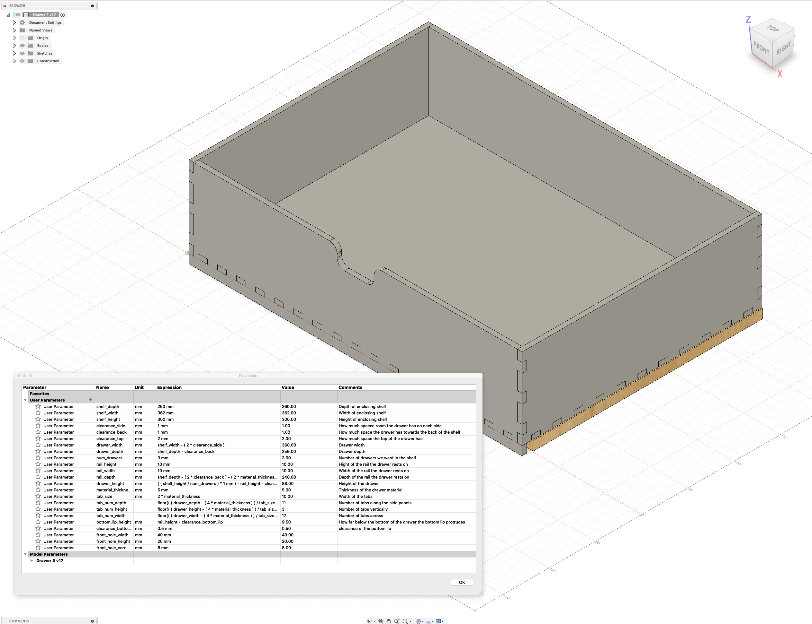

# Drawer

This is a Fusion 360 design for a lasercut drawer section that fits
inside the [Billy bookshelf from
IKEA](https://www.ikea.com/no/no/p/billy-bokhylle-hvit-s49217734/),
but that should work equally well with any other bookshelf.

## Adjust the dimensions

The dimensions have been measured and they're not quite as given in
the drawings from IKEA (they tend to be a few millimeters off here and
there, so you may have to adjust the dimensions a bit to fit your
bookshelf. Note that if you import the F3D (Fusion Archive File) you
can adjust the parameters yourself.  

Of course, the design is made generic so it should fit any bookshelf
as long as you measure the dimensions carefully and type them into the
parameter section. 

## No kerf setting

For now there is no setting to allow for kerf.  I'll add that later
when I've had some time to test the design.

## Disclaimer

Note that the model should be parameter driven, but that I may have
made mistakes that will make the model wonky if you alter parameters.
If you spot errors I've made feel free to correct them.

